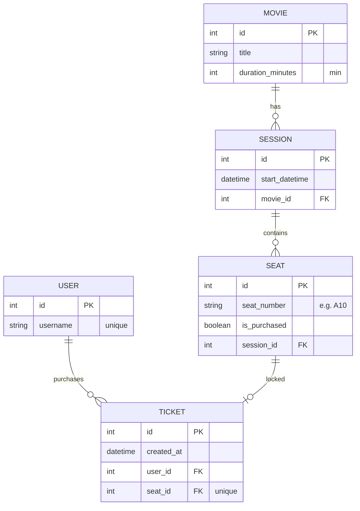

# CineReserve API 🍿

CineReserve is a high-performance, scalable RESTful backend built for modern cinema operations (specifically tailored for "Cinépolis Natal"). It handles user authentication, movie cataloging, real-time seat availability, and a robust ticket reservation flow using distributed locks.

## 🏗 Architecture & Tech Stack

* **Language:** Python 3.12+
* **Framework:** Django & Django REST Framework (DRF)
* **Database:** PostgreSQL (Relational data, Transactions, ACID compliance)
* **Cache & Lock Manager:** Redis (Distributed locking for seat reservations, caching high-read endpoints)
* **Task Queue:** Celery (Background tasks, lock expiration, emails)
* **Dependency Management:** Poetry
* **Containerization:** Docker & Docker Compose
* **CI/CD:** GitHub Actions
* **Documentation:** Swagger (via drf-spectacular)

## 🗄️ Database Design & Concurrency Strategy

To ensure robust concurrency control and fulfill the strict requirements for seat locking (Case 4 and 5), we opted for an explicit relational mapping for sessions and seats:

* **`Movie`:** Contains catalog details (title, description, duration).
* **`Session`:** Represents a specific screening (datetime) linked to a Movie.
* **`Seat`:** Instead of calculating seats on the fly, every single seat for a session is explicitly mapped in the database with a unique identifier (e.g., 'A1', 'A2') and a permanent `is_purchased` boolean state.
* **State Management:** The "Available" and "Purchased" states are the source of truth in PostgreSQL. The "Reserved" (locked) state is dynamically handled in-memory using Redis with a 10-minute TTL, ensuring extreme performance and zero database deadlocks during high-traffic checkout flows.



## 🚀 How to Run (Local Environment)

1. Clone the repository:

   ```bash
   git clone [https://github.com/PatoCareca1/cinereserve.git](https://github.com/PatoCareca1/cinereserve.git)
   cd cinereserve

### Start the infrastructure (PostgreSQL, Redis, Application, Celery Worker) using Docker

docker-compose up --build

### Access the API Documentation

Swagger UI: <http://localhost:8000/api/schema/swagger-ui/>

## Feature Implementation Checklist

### Core Requirements

[X] [TC.1] API Development: RESTful API using Python + Poetry + Django REST Framework.

[X] [TC.2] Authentication: JWT-based user authentication & secure session management.

[X] [TC.3.1] Database: PostgreSQL with optimized normalized design.

[X] [TC.3.2] Caching & Scalability: - [X] Redis distributed lock for 10-minute temporary seat reservations.

[X] Redis caching for popular sessions and movies.

[X] [TC.4] Pagination: Applied to Movies, Sessions, and User Tickets endpoints.

[X] [TC.5] Testing: Comprehensive Unit testing covering functional and edge cases.

[X] [TC.6] Documentation: OpenAPI/Swagger detailed endpoints.

[X] [TC.7] Docker: Dockerfile and docker-compose.yml configured.

### Use Cases Flow

[x] Case 1: Registration and Login.

[X] Case 2: List all available movies.

[X] Case 3: List all available sessions for a specific movie.

[X] Case 4: Seat Map Visualization (Distinguish: Available, Reserved, Purchased).

[X] Case 5: Reservation & Locking (10-minute Redis lock).

[X] Case 6: Checkout & Ticket Generation (Free tickets, lock transitions to permanent DB record).

[X] Case 7: "My Tickets" Portal (List user's active/past tickets).

### Advanced

[ ] Security: Rate limiting, input validation, SQLi & CSRF prevention.

[ ] Asynchronous Tasks: Celery for background processing (auto-releasing locks).

[ ] CI/CD: GitHub Actions pipeline to run tests on every push/PR.
