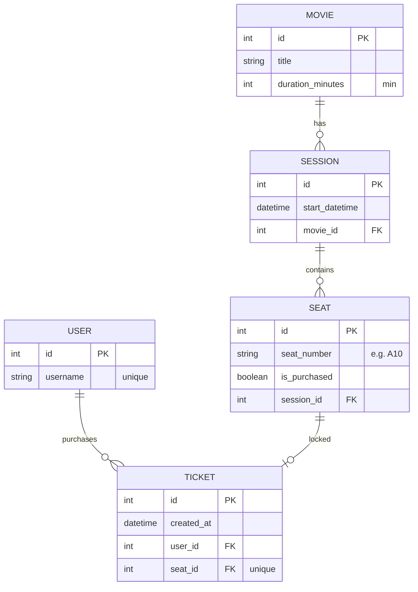

# CineReserve API 🍿

[](https://www.python.org/)
[](https://www.djangoproject.com/)
[](https://www.postgresql.org/)
[](https://redis.io/)
[](https://www.docker.com/)

CineReserve is a high-performance, scalable RESTful backend built for modern cinema operations (specifically tailored for "Cinépolis Natal"). It handles user authentication, movie cataloging, real-time seat availability, and a robust ticket reservation flow using distributed locks.

## 🚀 Live Demo

You don't need to run anything locally to evaluate the project. Both the API documentation and the fully functional frontend are live:

👉 **[Interactive API Documentation (Swagger)](https://cinereserve-api-j1z2.onrender.com/api/docs/)**
👉 **[Live Frontend Web App](https://cinereserve.lucasdaniel.dev.br/)**

*(Note: The API is hosted on Render's free tier, so the first request might take a few seconds to wake up the server).*

---

## 🏗 Architecture & Tech Stack

* **Language:** Python 3.12+
* **Framework:** Django & Django REST Framework (DRF)
* **Database:** PostgreSQL (Relational data, Transactions, ACID compliance)
* **Cache & Lock Manager:** Redis (Distributed locking for seat reservations, caching high-read endpoints)
* **Task Queue:** Celery (Background tasks, asynchronous processing)
* **Dependency Management:** Poetry
* **Containerization:** Docker & Docker Compose
* **CI/CD:** GitHub Actions (Automated testing on every push)
* **Documentation:** Swagger (via drf-spectacular)

## 🗄️ Database Design & Concurrency Strategy

To ensure robust concurrency control and fulfill the strict requirements for seat locking (preventing double-bookings under heavy load), we opted for an explicit relational mapping:

* **`Movie`:** Contains catalog details (title, description, duration).
* **`Session`:** Represents a specific screening (datetime) linked to a Movie.
* **`Seat`:** Instead of calculating seats on the fly, every single seat for a session is explicitly mapped in the database with a unique identifier (e.g., 'A1', 'A2') and a permanent `is_purchased` boolean state.
* **State Management (The Locking Mechanism):** The "Available" and "Purchased" states are the source of truth in PostgreSQL. The "Reserved" (locked) state is dynamically handled **in-memory using Redis** with a 10-minute TTL. This ensures extreme performance, atomic lock acquisition (`SET NX EX`), and zero database deadlocks during high-traffic checkout flows.



## 📂 Project Structure

```text
src/
├── core/           # Main Django settings, WSGI/ASGI, Celery config, Root URLs
├── movies/         # Movies, Sessions, and Seats models/views (The Catalog)
├── tickets/        # Reservation logic, Redis locking, Checkout flow, Tasks
├── users/          # Custom User model, JWT Authentication endpoints
└── manage.py       # Django entrypoint
```

## ⚙️ Environment Variables

The project uses sane defaults for local development, but respects standard environment variables for production configuration:

| Variable | Description | Default |
|---|---|---|
| `DB_NAME` | PostgreSQL Database Name | `cinereserve_db` |
| `DB_USER` | PostgreSQL User | `cinereserve_user` |
| `DB_PASSWORD` | PostgreSQL Password | `cinereserve_password` |
| `DB_HOST` | PostgreSQL Host address | `db` (Docker service name) |
| `DB_PORT` | PostgreSQL Port | `5432` |
| `REDIS_URL` | Redis Connection String | `redis://redis:6379/0` |

---

## 🛠️ Quickstart (How to Run Locally)

To make the evaluation process as smooth as possible, I have implemented a `Makefile` that abstracts the complex Docker commands. **However, this is completely optional.** If you prefer to use the standard Docker commands, the original equivalent is provided right below each step.

*(Note: If using Make, remember to always prefix the command with `make`, e.g., `make up`)*

### Prerequisites
* Docker & Docker Compose
* Make (optional)

### Step-by-Step

**1. Start the infrastructure** (Database, Redis, Celery, and the Web API):
* Using Make: `make up`
* Using Docker: `docker-compose up -d`

**2. Apply migrations:**
* Using Make: `make migrate`
* Using Docker: `docker-compose exec web python manage.py migrate`

**3. Populate the database with test data** (Creates Movies, Sessions, and Seats):
* Using Make: `make seed`
* Using Docker: `docker-compose exec web python manage.py seed_db`

**4. Run the automated test suite** (Validates concurrency, Redis locks, and business logic):
* Using Make: `make test`
* Using Docker: `docker-compose exec web python manage.py test`

## 📖 Local API Documentation

Once the application is running locally, the interactive Swagger documentation is available at:
👉 **[http://localhost:8000/api/docs/](http://localhost:8000/api/docs/)**

## ✅ Feature Implementation Checklist

### Core Requirements

- [X] **[TC.1] API Development:** RESTful API using Python + Poetry + Django REST Framework.
- [X] **[TC.2] Authentication:** JWT-based user authentication & secure session management.
- [X] **[TC.3.1] Database:** PostgreSQL with optimized normalized design.
- [X] **[TC.3.2] Caching & Scalability:** 
  - [X] Redis distributed lock for 10-minute temporary seat reservations.
  - [X] Redis caching for popular sessions and movies.
- [X] **[TC.4] Pagination:** Applied to Movies, Sessions, and User Tickets endpoints.
- [X] **[TC.5] Testing:** Comprehensive Unit testing covering functional and edge cases.
- [X] **[TC.6] Documentation:** OpenAPI/Swagger detailed endpoints.
- [X] **[TC.7] Docker:** Dockerfile and docker-compose.yml configured.

### Use Cases Flow

- [X] **Case 1:** Registration and Login.
- [X] **Case 2:** List all available movies.
- [X] **Case 3:** List all available sessions for a specific movie.
- [X] **Case 4:** Seat Map Visualization (Distinguish: Available, Reserved, Purchased).
- [X] **Case 5:** Reservation & Locking (10-minute Redis lock).
- [X] **Case 6:** Checkout & Ticket Generation (Free tickets, lock transitions to permanent DB record).
- [X] **Case 7:** "My Tickets" Portal (List user's active/past tickets).

### Advanced

- [X] **Security:** Rate limiting, input validation, SQLi & CSRF prevention.
- [X] **Asynchronous Tasks:** Celery for background processing (auto-releasing locks, notifications).
- [X] **CI/CD:** GitHub Actions pipeline to run tests on every push/PR.
